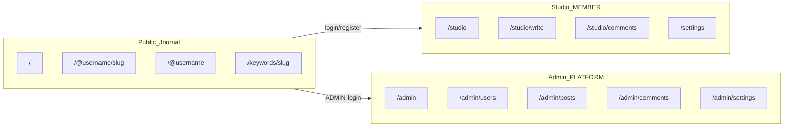
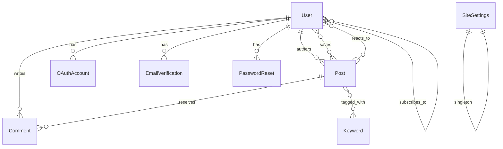

# The Journal

> A multi-author publishing platform I built with Spring Boot: public reading, a creator Studio, and a platform Admin panel.

---

## Table of Contents

1. [What I Built](#what-i-built)
2. [Who This Is For](#who-this-is-for)
3. [The Three Surfaces of the Site](#the-three-surfaces-of-the-site)
4. [Features](#features)
5. [Routes & Endpoints](#routes--endpoints)
6. [Tech Stack](#tech-stack)
7. [Architecture & Design Patterns](#architecture--design-patterns)
8. [Data Model](#data-model)
9. [Security](#security)
10. [Frontend & Design](#frontend--design)
11. [Project Structure](#project-structure)
12. [How I Developed This (SDLC)](#how-i-developed-this-sdlc)
13. [Configuration](#configuration)
14. [Getting Started](#getting-started)
15. [Running Tests](#running-tests)
16. [Building for Production](#building-for-production)
17. [What I Deliberately Did Not Build](#what-i-deliberately-did-not-build)
18. [Known Limitations & Future Ideas](#known-limitations--future-ideas)

---

## What I Built

I built **The Journal**: a self-hosted, multi-author publishing platform. It is not a headless API or a social network. It is a focused tool for writing, discovering, and engaging with long-form content on the web.

The site has three distinct surfaces:

- **The Journal (public)** — A calm, editorial reading experience where visitors browse published posts, explore writing by keyword, and visit creator profiles at `/@username`.
- **Studio (creators)** — A private workspace where members draft posts, schedule publishing, moderate comments on their own writing, and manage their profile.
- **Admin (platform operators)** — A platform panel with analytics, user management, global comment moderation, and site-wide settings.

I chose a **server-rendered** approach over a JavaScript SPA because this is a content site, not a complex interactive application. Thymeleaf templates keep the stack simple, SEO-friendly, and easy to reason about. The only JSON endpoint exists to support image uploads from the rich-text editor; all other interactions use form posts and redirects.

---

## Who This Is For

This project is designed for:

- **A platform operator** who wants to run a small publishing site with multiple writers, without depending on Medium, WordPress, or a SaaS CMS.
- **Creators and readers** who want accounts, subscriptions, saved posts, and comments on a personal-scale platform.
- **Someone learning Spring Boot** who wants a real, end-to-end example of MVC, JPA, Security, OAuth2, and Thymeleaf working together.

It is **not** designed for large-scale social networks, API-first integrations, or enterprise multi-tenancy.

---

## The Three Surfaces of the Site



### The Journal (Public)

This is what readers see. I designed it to feel like a personal publication: quiet typography, warm paper tones, and a layout that puts the writing first.

| Page | What visitors see |
|------|-------------------|
| **Home** (`/`) | Latest published posts plus a discover feed |
| **Post detail** (`/@{username}/{slug}`) | Full article with rich HTML, keywords, author info, comments, and engagement controls |
| **Creator profile** (`/@{username}`) | A creator's bio, avatar, and published posts |
| **Keyword browse** (`/keywords/{slug}`) | All published posts tagged with a specific keyword |
| **Creators directory** (`/creators`) | All registered members (requires login) |

Only posts with status `PUBLISHED` are visible here. Drafts and scheduled posts are completely hidden from the public. Legacy URLs at `/posts/{slug}` redirect to the new `/@{username}/{slug}` format.

### Studio (Creators — MEMBER role)

This is where creators manage their writing. It requires authentication with the `MEMBER` role and a verified email address.

| Page | What creators can do |
|------|----------------------|
| **Dashboard** (`/studio`) | See all own posts (draft, published, scheduled) with status badges |
| **Write** (`/studio/write`) | Create a new article in the Quill rich-text editor |
| **Edit post** (`/studio/posts/{id}/edit`) | Update an existing post |
| **Comments** (`/studio/comments`) | Approve or reject pending comments on own posts |
| **Settings** (`/settings`) | Update profile, bio, username, password; link/unlink Google |
| **Login** (`/login`) | Sign in via form or Google OAuth |

### Admin (Platform — ADMIN role)

This is where the platform operator manages the site. It requires the `ADMIN` role.

| Page | What operators can do |
|------|----------------------|
| **Dashboard** (`/admin`) | Analytics charts: user/post growth, status breakdowns, recent activity |
| **Users** (`/admin/users`) | View all users; enable or disable accounts |
| **Posts** (`/admin/posts`) | View all posts across creators; force-unpublish |
| **Comments** (`/admin/comments`) | Moderate comments platform-wide |
| **Site settings** (`/admin/settings`) | Change site name and tagline |
| **Profile** (`/admin/profile`) | Update admin credentials, email (with verification), Google link |

### Member Engagement Pages

Logged-in members (`MEMBER` role) also have access to:

| Page | Purpose |
|------|---------|
| **Saved** (`/saved`) | Bookmarked posts |
| **Subscriptions** (`/subscriptions`) | Feed of posts from followed creators |

---

## Features

### User Accounts & Authentication

| Feature | Description |
|---------|-------------|
| **Registration** | Email/password sign-up at `/register` |
| **Email verification** | OTP code sent via email (or logged to console in dev); required before Studio access |
| **Password reset** | Code-based forgot/reset flow at `/forgot-password` and `/reset-password` |
| **Google OAuth** | Sign in or sign up with Google; new users pick a username at `/oauth/complete` |
| **Account linking** | Connect or disconnect Google from `/settings` or `/admin/profile` |
| **Account lockout** | Locked for 30 minutes after 10 failed login attempts |
| **Rate limiting** | Login limited to 10 attempts per 15 minutes; OTP paths limited to 5 per 15 minutes |

### Content Management (Studio)

| Feature | Description |
|---------|-------------|
| **Post CRUD** | Creators create, read, update, and delete their own posts from Studio |
| **Rich text editing** | Posts are written in a Quill 2.0 WYSIWYG editor and stored as sanitized HTML |
| **Title & excerpt** | Every post has a title (max 160 chars) and a short excerpt (max 320 chars) for listings |
| **Per-author slugs** | URLs are `/@{username}/{slug}`; slugs are unique per author, not globally |
| **Three post statuses** | `DRAFT` (hidden), `PUBLISHED` (live), `SCHEDULED` (goes live automatically at a chosen date/time) |
| **Scheduled publishing** | A background job runs every 60 seconds and publishes scheduled posts whose time has arrived |
| **Keyword tagging** | Comma-separated keywords are normalized, deduplicated, and linked to posts |
| **Keyword browse pages** | Readers can click a keyword to see all published posts with that tag |

### Engagement

| Feature | Description |
|---------|-------------|
| **Comments** | Members comment on published posts; comments start as `PENDING` and require creator or admin approval |
| **Saved posts** | Members bookmark posts for later reading |
| **Creator subscriptions** | Members follow creators and see their posts in `/subscriptions` |
| **Useful reactions** | Members mark posts as "useful"; count shown on post pages |

### Media & Profiles

| Feature | Description |
|---------|-------------|
| **Image uploads** | JPEG, PNG, GIF, and WebP images up to 5 MB; stored on disk with UUID filenames |
| **In-editor images** | The Quill editor uploads images directly into post content via `/studio/uploads/images` |
| **Creator profiles** | Display name, bio, avatar, and username shown on public post and profile pages |
| **Avatar placeholder** | Default avatar when no image is uploaded |

### Platform Administration

| Feature | Description |
|---------|-------------|
| **Analytics dashboard** | 30-day charts for users, posts, and status breakdowns |
| **User management** | Enable or disable member accounts |
| **Global moderation** | Approve or reject any comment; force-unpublish any post |
| **Site settings** | Editable site name and tagline stored in `site_settings` |
| **Admin email change** | Request and verify email change with OTP codes |

### Security & Safety

| Feature | Description |
|---------|-------------|
| **Role-based access** | `ADMIN` for platform ops; `MEMBER` for creators/readers; roles are mutually exclusive |
| **HTML sanitization** | Post content passes through OWASP Java HTML Sanitizer; comments are stripped to plain text |
| **CSRF protection** | Enabled on all forms and the image upload AJAX call |
| **Access control** | `/admin/**` requires `ADMIN`; `/studio/**`, `/settings/**`, engagement routes require `MEMBER` |
| **Custom error pages** | Branded 400, 401, 403, 404, and 500 pages |

### Developer Experience

| Feature | Description |
|---------|-------------|
| **MariaDB database** | Persistent storage via MariaDB/MySQL (port configurable via `DB_PORT`) |
| **SQL migrations** | `sql/migrate-all.sql` for fresh installs; incremental scripts for upgrades |
| **Dotenv support** | `.env` file loaded automatically via `DotEnvLoader` |
| **Maven Wrapper** | Reproducible builds without requiring a global Maven install |
| **Test profile** | Tests use an in-memory H2 database and a temp upload directory |
| **34 automated tests** | Integration tests cover public pages, OAuth, admin platform, studio, settings, and uploads |

---

## Routes & Endpoints

### Public Page Routes

Handled by `@Controller` classes; return Thymeleaf HTML views.

| Method | Route | Controller | Template | Purpose |
|--------|-------|------------|----------|---------|
| `GET` | `/` | `PublicBlogController` | `index.html` | Home with latest and discover feeds |
| `GET` | `/posts/{slug}` | `PublicBlogController` | redirect | Legacy URL → `/@{author}/{slug}` |
| `GET` | `/@{username}/{slug}` | `PublicBlogController` | `post.html` | Single published post |
| `GET` | `/@{username}` | `PublicBlogController` | `creator.html` | Creator profile and posts |
| `GET` | `/creators` | `PublicBlogController` | `creators.html` | All members (MEMBER role required) |
| `GET` | `/keywords/{slug}` | `PublicBlogController` | `keyword.html` | Posts filtered by keyword |
| `GET` | `/login` | `LoginController` | `login.html` | Login form |

### Auth Routes

| Method | Route | Controller | Template | Purpose |
|--------|-------|------------|----------|---------|
| `GET` | `/register` | `AuthController` | `auth/register.html` | Registration form |
| `POST` | `/register` | `AuthController` | redirect | Create account |
| `GET` | `/verify-email` | `AuthController` | `auth/verify-email.html` | Email verification form |
| `POST` | `/verify-email` | `AuthController` | redirect | Submit verification code |
| `GET` | `/forgot-password` | `AuthController` | `auth/forgot-password.html` | Forgot password form |
| `POST` | `/forgot-password` | `AuthController` | redirect | Send reset code |
| `GET` | `/reset-password` | `AuthController` | `auth/reset-password.html` | Reset password form |
| `POST` | `/reset-password` | `AuthController` | redirect | Set new password |
| `GET` | `/oauth/complete` | `OAuthController` | `auth/oauth-complete.html` | Pick username after Google sign-up |
| `POST` | `/oauth/complete` | `OAuthController` | redirect | Complete OAuth registration |

### Member Engagement Routes

All require the `MEMBER` role.

| Method | Route | Controller | Template / Action | Purpose |
|--------|-------|------------|-------------------|---------|
| `GET` | `/saved` | `EngagementController` | `saved.html` | Saved posts |
| `GET` | `/subscriptions` | `EngagementController` | `subscriptions.html` | Subscribed creators' posts |
| `POST` | `/engagement/posts/{id}/save` | `EngagementController` | redirect | Toggle bookmark |
| `POST` | `/engagement/posts/{id}/useful` | `EngagementController` | redirect | Toggle useful reaction |
| `POST` | `/engagement/creators/{username}/subscribe` | `EngagementController` | redirect | Toggle creator subscription |
| `POST` | `/comments/posts/{id}` | `CommentController` | redirect | Submit comment (PENDING) |

### Studio Routes (MEMBER role)

| Method | Route | Controller | Template / Action | Purpose |
|--------|-------|------------|-------------------|---------|
| `GET` | `/studio` | `StudioPostController` | `studio/list.html` | Post dashboard |
| `GET` | `/studio/write`, `/studio/posts/new` | `StudioPostController` | `studio/write.html` | New post editor |
| `POST` | `/studio/posts` | `StudioPostController` | redirect → `/studio` | Create a post |
| `GET` | `/studio/posts/{id}/edit` | `StudioPostController` | `studio/write.html` | Edit existing post |
| `POST` | `/studio/posts/{id}` | `StudioPostController` | redirect → `/studio` | Update a post |
| `POST` | `/studio/posts/{id}/delete` | `StudioPostController` | redirect → `/studio` | Delete a post |
| `GET` | `/studio/comments` | `StudioCommentController` | `studio/comments.html` | Pending comments on own posts |
| `POST` | `/studio/comments/{id}/approve` | `StudioCommentController` | redirect | Approve comment |
| `POST` | `/studio/comments/{id}/reject` | `StudioCommentController` | redirect | Reject comment |
| `GET` | `/settings` | `SettingsController` | `settings.html` | Creator settings |
| `POST` | `/settings/profile` | `SettingsController` | redirect | Update profile |
| `POST` | `/settings/password` | `SettingsController` | redirect | Change password |
| `GET` | `/settings/connect/google` | `SettingsController` | redirect | Link Google account |
| `POST` | `/settings/disconnect/google` | `SettingsController` | redirect | Unlink Google account |

### Admin Routes (ADMIN role)

| Method | Route | Controller | Template / Action | Purpose |
|--------|-------|------------|-------------------|---------|
| `GET` | `/admin` | `AdminPlatformController` | `admin/dashboard.html` | Analytics dashboard |
| `GET` | `/admin/users` | `AdminPlatformController` | `admin/users.html` | User list |
| `POST` | `/admin/users/{id}/toggle` | `AdminPlatformController` | redirect | Enable/disable user |
| `GET` | `/admin/posts` | `AdminPlatformController` | `admin/posts.html` | All posts |
| `POST` | `/admin/posts/{id}/unpublish` | `AdminPlatformController` | redirect | Force draft |
| `GET` | `/admin/comments` | `AdminPlatformController` | `admin/comments.html` | All comments |
| `POST` | `/admin/comments/{id}/approve` | `AdminPlatformController` | redirect | Approve comment |
| `POST` | `/admin/comments/{id}/reject` | `AdminPlatformController` | redirect | Reject comment |
| `GET` | `/admin/settings` | `AdminPlatformController` | `admin/site-settings.html` | Site settings form |
| `POST` | `/admin/settings` | `AdminPlatformController` | redirect | Update site name/tagline |
| `GET` | `/admin/profile` | `AdminPlatformController` | `admin/profile.html` | Admin profile |
| `POST` | `/admin/profile` | `AdminPlatformController` | redirect | Update display name |
| `POST` | `/admin/profile/password` | `AdminPlatformController` | redirect | Change password |
| `POST` | `/admin/profile/email` | `AdminPlatformController` | redirect | Request email change |
| `POST` | `/admin/profile/email/verify` | `AdminPlatformController` | redirect | Confirm email change |
| `GET` | `/admin/profile/connect/google` | `AdminPlatformController` | redirect | Link Google |
| `POST` | `/admin/profile/disconnect/google` | `AdminPlatformController` | redirect | Unlink Google |

### JSON API

There is exactly **one** REST endpoint in the project:

| Method | Route | Controller | Auth | Request | Response |
|--------|-------|------------|------|---------|----------|
| `POST` | `/studio/uploads/images` | `StudioUploadController` | `MEMBER` | `multipart/form-data` with field `upload` | `{"url": "/uploads/{uuid}.{ext}"}` |

This is consumed by `studio-editor.js` when inserting images into the Quill editor.

### Spring Security Routes

| Method | Route | Behavior |
|--------|-------|----------|
| `POST` | `/login` | Form login; ADMIN → `/admin`, unverified → `/verify-email`, MEMBER → `/studio` |
| `GET` | `/oauth2/authorization/google` | Initiate Google OAuth |
| `GET` | `/login/oauth2/code/google` | Google OAuth callback |
| `POST` | `/logout` | Logout and redirect to `/` |

### Static & Uploaded Resources

| Path | Source |
|------|--------|
| `/css/app.css` | `src/main/resources/static/css/app.css` |
| `/js/app.js` | `src/main/resources/static/js/app.js` |
| `/js/studio-editor.js` | `src/main/resources/static/js/studio-editor.js` |
| `/js/admin-dashboard.js` | `src/main/resources/static/js/admin-dashboard.js` |
| `/images/logo.svg` | `src/main/resources/static/images/logo.svg` |
| `/images/favicon.svg` | `src/main/resources/static/images/favicon.svg` |
| `/images/google.svg` | `src/main/resources/static/images/google.svg` |
| `/images/avatar-placeholder.svg` | `src/main/resources/static/images/avatar-placeholder.svg` |
| `/uploads/**` | Filesystem directory (`./data/uploads/`) served via `WebConfig` |

### Error Pages

| Route | Template | When it appears |
|-------|----------|-----------------|
| `/error` | `error.html` | Generic fallback |
| `/error/400.html` | `error/400.html` | Bad request |
| `/error/401.html` | `error/401.html` | Unauthorized |
| `/error/403.html` | `error/403.html` | Access denied |
| `/error/404.html` | `error/404.html` | Page not found |
| `/error/500.html` | `error/500.html` | Server error |

---

## Tech Stack

### Backend

| Technology | Version | Why I chose it |
|------------|---------|----------------|
| **Java** | 17 | LTS release with modern language features |
| **Spring Boot** | 4.1.0 | Convention-over-configuration for rapid development |
| **Spring Web MVC** | (via starter) | Server-side rendering with `@Controller` |
| **Spring Data JPA** | (via starter) | Repository pattern with minimal boilerplate |
| **Spring Security** | (via starter) | Form login, OAuth2, role-based access, CSRF |
| **Spring Mail** | (via starter) | Email verification and password reset codes |
| **Spring OAuth2 Client** | (via starter) | Google sign-in and account linking |
| **Thymeleaf** | (via starter) | Natural HTML templates with Spring integration |
| **Thymeleaf Spring Security extras** | 6.x | `sec:authorize` tags in templates |
| **Bean Validation** | (via starter) | `@Valid` on form objects |
| **MariaDB** | (runtime) | Persistent relational database for production use |
| **H2 Database** | (test) | In-memory database for automated tests only |
| **OWASP Java HTML Sanitizer** | 20260313.1 | Battle-tested XSS prevention for user-authored HTML |

### Frontend

| Technology | Source | Purpose |
|------------|--------|---------|
| **Thymeleaf** | Server-side | All HTML rendering |
| **Vanilla CSS** | `app.css` (~2,600 lines) | Full design system with CSS custom properties |
| **Vanilla JavaScript** | `app.js`, `studio-editor.js`, `admin-dashboard.js` | Confirmations, Quill init, image upload, analytics charts |
| **Quill** | 2.0.3 (jsDelivr CDN) | Rich-text WYSIWYG editor in Studio |
| **Google Fonts** | CDN | Inter (UI) + Newsreader (editorial serif) |

### Build & Test

| Tool | Version | Purpose |
|------|---------|---------|
| **Maven** | 3.9.16 (wrapper) | Dependency management and build |
| **JUnit 5** | (via Spring Boot Test) | Unit and integration tests |
| **MockMvc** | (via starter-webmvc-test) | HTTP-level controller tests |
| **Spring Security Test** | (via starter-security-test) | `@WithMockUser`, CSRF token helpers |

---

## Architecture & Design Patterns

I organized the codebase using a **layered, package-by-feature** architecture.

### Architectural Patterns

| Pattern | Where I use it | Why |
|---------|----------------|-----|
| **Model-View-Controller (MVC)** | All `@Controller` classes return Thymeleaf view names with `Model` attributes | Separates HTTP handling from business logic and presentation |
| **Layered Architecture** | Controller → Service → Repository → Entity | Clear responsibility boundaries |
| **Package by Feature** | `admin`, `auth`, `comment`, `engagement`, `post`, `publicsite`, `settings`, `studio`, `upload`, `user` | Related code lives together |

### Structural Patterns

| Pattern | Where I use it | Why |
|---------|----------------|-----|
| **Repository Pattern** | `PostRepository`, `UserRepository`, `CommentRepository`, etc. | Spring Data JPA abstracts persistence |
| **Service Layer** | `PostService`, `UserService`, `EngagementService`, `CommentService`, etc. | Business logic and transaction boundaries |
| **Form/DTO Objects** | `PostForm`, `RegisterForm`, `ProfileForm`, etc. | Decouple HTTP form fields from JPA entities |
| **Composite Primary Keys** | `SavedPost`, `PostReaction`, `CreatorSubscription` | Natural keys for engagement join entities |
| **Singleton Row** | `SiteSettings` always uses `id = 1L` | Single site configuration record |

### Behavioral Patterns

| Pattern | Where I use it | Why |
|---------|----------------|-----|
| **Post-Redirect-Get (PRG)** | All mutation handlers redirect after success | Prevents duplicate submissions on browser refresh |
| **Strategy / Policy** | `BlogHtmlSanitizer` uses OWASP `HtmlPolicyBuilder` | Configurable allowlist for safe HTML |
| **Scheduled Task** | `PostPublishScheduler` with `@Scheduled(fixedRate = 60_000)` | Background publishing without manual intervention |
| **Filter Chain** | `AuthRateLimitFilter`, `EmailVerifiedFilter` | Rate limiting and email verification enforcement |
| **OAuth Provisioning** | `OAuthUserProvisioningService`, `OAuthRegistrationService` | Link existing accounts or complete new sign-ups |
| **Controller Advice** | `SiteModelAdvice`, `StudioPanelModelAdvice` | Inject shared model attributes globally |

### Spring-Specific Patterns

| Pattern | Where I use it |
|---------|----------------|
| **Dependency Injection** | Constructor injection throughout |
| **Transaction Management** | `@Transactional` on service methods; `readOnly = true` for queries |
| **Configuration Properties** | `BlogProperties` with `@Value` for externalized config |
| **Dotenv Loading** | `DotEnvLoader`, `DotEnvEnvironmentPostProcessor` |
| **Resource Handler** | `WebConfig` maps `/uploads/**` to the filesystem upload directory |
| **Application Bootstrap** | `UserBootstrap` seeds admin account and site settings on first run |

### What I did NOT use

- No microservices: this is a single deployable JAR
- No event sourcing or CQRS: straightforward CRUD
- No caching layer (Redis, etc.)
- No message queues
- No API gateway or BFF pattern

---

## Data Model

I use eleven main entities plus join tables. Schema is defined in `sql/migrate-all.sql` and validated by Hibernate (`ddl-auto=validate`). Apply schema changes explicitly with the SQL migration scripts before starting production.

### Entity Relationship



### User

| Field | Type | Notes |
|-------|------|-------|
| `id` | `Long` | Auto-generated primary key |
| `email` | `String` | Unique, used for login and verification |
| `username` | `String` (80) | Unique, used in `/@{username}` URLs |
| `passwordHash` | `String` (120) | Bcrypt-encoded; nullable for OAuth-only accounts |
| `displayName` | `String` (80) | Shown on public pages |
| `bio` | `String` (500) | Optional creator bio |
| `avatarUrl` | `String` (255) | Optional path like `/uploads/{uuid}.jpg` |
| `emailVerified` | `boolean` | Must be true for Studio access |
| `enabled` | `boolean` | Admin can disable accounts |
| `failedLoginAttempts` | `int` | Tracks failed logins for lockout |
| `lockedUntil` | `Instant` | Account locked until this time |
| `roles` | `Set<UserRole>` | `ADMIN` or `MEMBER` (mutually exclusive) |

### Post

| Field | Type | Notes |
|-------|------|-------|
| `id` | `Long` | Auto-generated primary key |
| `author` | `User` | Many-to-one; each post belongs to one creator |
| `title` | `String` (160) | Required |
| `slug` | `String` (180) | Unique per author (not globally) |
| `excerpt` | `String` (320) | Required, shown in listings |
| `contentHtml` | `LONGTEXT` | Sanitized rich HTML |
| `status` | `PostStatus` enum | `DRAFT`, `PUBLISHED`, or `SCHEDULED` |
| `createdAt` | `Instant` | Set on first save |
| `updatedAt` | `Instant` | Updated on every save |
| `publishedAt` | `Instant` | Set when status becomes `PUBLISHED` |
| `scheduledAt` | `Instant` | Set when status is `SCHEDULED` |
| `keywords` | `Set<Keyword>` | Many-to-many, lazy-loaded |

### Comment

| Field | Type | Notes |
|-------|------|-------|
| `id` | `Long` | Auto-generated |
| `post` | `Post` | The post being commented on |
| `author` | `User` | The commenter |
| `body` | `String` (2000) | Plain text (HTML stripped) |
| `status` | `CommentStatus` | `PENDING`, `APPROVED`, or `REJECTED` |

### Engagement Entities

| Entity | Table | Purpose |
|--------|-------|---------|
| `SavedPost` | `saved_posts` | User bookmarks a post (composite PK: user + post) |
| `PostReaction` | `post_reactions` | User marks post as useful (composite PK: user + post + type) |
| `CreatorSubscription` | `creator_subscriptions` | User follows a creator (composite PK: subscriber + creator) |

### Auth Support Entities

| Entity | Purpose |
|--------|---------|
| `OAuthAccount` | Links a Google account to a user (provider + provider_user_id unique) |
| `EmailVerification` | OTP codes for email verification and admin email change |
| `PasswordReset` | OTP codes for password reset |

### SiteSettings

| Field | Type | Notes |
|-------|------|-------|
| `id` | `Long` | Always `1`: single site config |
| `siteName` | `String` (80) | Displayed in header and page titles |
| `tagline` | `String` (200) | Shown on the home page |

### Database Tables

| Table | Purpose |
|-------|---------|
| `users` | All user accounts |
| `user_roles` | Role assignments (`ADMIN`, `MEMBER`) |
| `posts` | Blog post records |
| `keywords` | Normalized keyword records |
| `post_keywords` | Many-to-many join table |
| `comments` | Post comments with moderation status |
| `saved_posts` | User bookmarks |
| `post_reactions` | Useful reactions |
| `creator_subscriptions` | Creator follow relationships |
| `oauth_accounts` | Google OAuth links |
| `email_verifications` | Verification OTP codes |
| `password_resets` | Password reset OTP codes |
| `site_settings` | Site name and tagline |

---

## Security

### Authentication

I implemented a **multi-user** authentication model with two roles:

- **Login page:** `/login` (form + Google OAuth button)
- **Form login redirect:** ADMIN → `/admin`; unverified → `/verify-email`; MEMBER → `/studio`
- **OAuth login:** New users → `/oauth/complete`; existing users → `/admin` or `/studio`
- **Logout redirect:** `/` (public home)
- **Roles:** `ADMIN` (platform operator) and `MEMBER` (creator/reader); mutually exclusive per user
- **Password storage:** Bcrypt via `PasswordEncoderFactories.createDelegatingPasswordEncoder()`

Default platform admin credentials (change before any real deployment):

| Field | Default | Override via |
|-------|---------|--------------|
| Email | `admin@localhost` | `BLOG_ADMIN_EMAIL` env var |
| Username | `admin` | `BLOG_ADMIN_USERNAME` env var |
| Password | `change-me-admin` | `BLOG_ADMIN_PASSWORD` env var |

The admin account is bootstrapped on first startup by `UserBootstrap` if it does not exist.

### Authorization Rules

| Path pattern | Access |
|--------------|--------|
| `/`, `/posts/**`, `/@/**`, `/keywords/**` | Public |
| `/uploads/**`, `/css/**`, `/js/**`, `/images/**` | Public |
| `/register`, `/login`, `/verify-email`, `/forgot-password`, `/reset-password` | Public |
| `/oauth/complete`, `/oauth2/**`, `/login/oauth2/code/**` | Public |
| `/error`, `/error/**` | Public |
| `/admin`, `/admin/**` | `ADMIN` role required |
| `/studio/**`, `/settings/**`, `/saved`, `/subscriptions`, `/creators`, `/engagement/**`, `/comments/**` | `MEMBER` role required |

### Account Protection

- **Failed login lockout:** 10 failed attempts → locked for 30 minutes
- **Rate limiting:** Login (10/15min), OTP verification and password reset (5/15min)
- **Email verification gate:** Unverified members cannot access `/studio/**` (except image uploads during registration flow)

### Content Safety

- **Post HTML:** Sanitized through `BlogHtmlSanitizer` — allowed elements, `/uploads/` images only, `rel="nofollow"` on links
- **Comments:** Stripped to plain text before storage
- **CSRF:** Enabled on all forms; image upload sends token via `X-CSRF-TOKEN` header

### Google OAuth

Requires real credentials from the Google Cloud Console:

| Variable | Purpose |
|----------|---------|
| `GOOGLE_CLIENT_ID` | OAuth client ID |
| `GOOGLE_CLIENT_SECRET` | OAuth client secret |

Placeholder values in `.env.example` will not work for actual sign-in.

---

## Frontend & Design

### Design Philosophy

The public site feels like a **personal publication**: warm paper tones, serif headlines, generous whitespace. Studio is utilitarian: a clean dashboard with status badges and a focused writing environment. Admin is data-driven: charts, tables, and moderation queues.

### Visual Identity

| Element | Public ("The Journal") | Studio | Admin |
|---------|------------------------|--------|-------|
| **Brand name** | The Journal (configurable) | Studio | Admin |
| **UI font** | Inter | Inter | Inter |
| **Editorial font** | Newsreader (serif) | N/A | N/A |
| **Color palette** | Warm paper, ink, sage accent | Same system | Same system |
| **Logo** | `logo.svg` (shared) | `logo.svg` | `logo.svg` |

### CSS Architecture

A single `app.css` file (~2,600 lines) using CSS custom properties, component-based class names, responsive breakpoints, and status color coding (draft/published/scheduled, comment pending/approved/rejected).

### Template Structure

Three layout fragment files:

| Fragment file | Used by |
|---------------|---------|
| `fragments/layout.html` | Public pages, auth pages, login |
| `fragments/studio-layout.html` | Studio and settings pages |
| `fragments/admin-layout.html` | Admin pages |

### JavaScript

| File | Purpose |
|------|---------|
| `app.js` | Delete confirmations, general UI interactions |
| `studio-editor.js` | Quill editor init, schedule datetime toggle, AJAX image upload with CSRF |
| `admin-dashboard.js` | Analytics chart rendering on the admin dashboard |

There is no frontend framework. JavaScript is minimal and purposeful.

---

## Project Structure

```
Blog App - Sprint Boot/
├── pom.xml                              # Maven build definition
├── mvnw, mvnw.cmd                       # Maven Wrapper scripts
├── .mvn/wrapper/                        # Wrapper configuration
├── .env.example                         # Environment variable template
├── .gitignore                           # Ignores target/, data/, .env, IDE files
│
├── sql/                                 # Database migration scripts
│   ├── 001_create_database.sql          # Creates blog_engine database
│   ├── 002_create_tables.sql            # Legacy v1 schema (single-creator)
│   ├── 003_multi_author_marketplace.sql # Upgrade v1 → multi-author
│   ├── 004_add_pending_email.sql        # Admin email change support
│   ├── 005_exclusive_roles.sql          # Mutually exclusive ADMIN/MEMBER
│   ├── migrate-all.sql                  # Fresh install: full current schema
│   └── migrate.sh                       # Run migrations (reads .env for host/port)
│
├── data/                                # Runtime data (gitignored)
│   └── uploads/                         # Uploaded images
│
├── src/
│   ├── main/
│   │   ├── java/com/example/blog/
│   │   │   ├── PersonalBlogEngineApplication.java
│   │   │   │
│   │   │   ├── admin/                   # Platform admin, analytics, site settings
│   │   │   ├── auth/                    # Registration, OAuth complete
│   │   │   ├── comment/                 # Comments and moderation
│   │   │   ├── config/                  # Security, OAuth, filters, dotenv
│   │   │   ├── engagement/              # Saved posts, reactions, subscriptions
│   │   │   ├── post/                    # Posts, keywords, scheduling, sanitization
│   │   │   ├── publicsite/              # Public pages
│   │   │   ├── settings/                # Creator settings
│   │   │   ├── studio/                  # Creator post/comment/upload controllers
│   │   │   ├── upload/                  # Image storage
│   │   │   └── user/                    # Users, OAuth, email, password reset, mail
│   │   │
│   │   └── resources/
│   │       ├── application.properties
│   │       ├── db/                      # Auto-applied schema patches
│   │       ├── static/
│   │       │   ├── css/app.css
│   │       │   ├── js/app.js, studio-editor.js, admin-dashboard.js
│   │       │   └── images/logo.svg, favicon.svg, google.svg, avatar-placeholder.svg
│   │       └── templates/
│   │           ├── fragments/           # layout.html, studio-layout.html, admin-layout.html
│   │           ├── auth/                # register, verify-email, forgot/reset-password, oauth-complete
│   │           ├── studio/              # list, write, comments
│   │           ├── admin/               # dashboard, users, posts, comments, site-settings, profile
│   │           ├── error/               # 400–500
│   │           └── (public pages)       # index, post, creator, creators, keyword, saved, subscriptions, login, settings
│   │
│   └── test/
│       ├── java/com/example/blog/
│       │   ├── PersonalBlogEngineApplicationTests.java
│       │   ├── publicsite/PublicBlogControllerTests.java
│       │   ├── post/PostServiceTests.java
│       │   ├── admin/AdminPlatformControllerTests.java
│       │   ├── auth/OAuthControllerTests.java
│       │   ├── config/OAuth2LoginSuccessHandlerTests.java
│       │   ├── studio/StudioUploadControllerTests.java
│       │   └── settings/SettingsControllerTests.java
│       └── resources/
│           └── application-test.properties
│
└── target/                              # Maven build output (gitignored)
```

**90 Java source files** in `src/main/java`, **8 test classes** with **34 test methods**, **32 Thymeleaf templates**.

---

## How I Developed This (SDLC)

### Methodology

I followed an **iterative, feature-driven** approach: closer to Agile/Scrum principles than Waterfall.

| Phase | What I did |
|-------|------------|
| **Requirements** | Started as a single-creator blog; evolved into multi-author platform with engagement |
| **Design** | Three-zone architecture (public + Studio + Admin), server-rendered Thymeleaf, role-based security |
| **Implementation** | Built bottom-up: entities → repositories → services → controllers → templates → CSS |
| **Testing** | Integration tests alongside features using MockMvc; 34 tests covering happy paths and edge cases |
| **Review** | Manually tested all flows; verified security boundaries, OAuth, and moderation workflows |

### Development Practices

| Practice | How I applied it |
|----------|------------------|
| **Package by feature** | Code grouped by domain (`post`, `user`, `engagement`, etc.) |
| **Convention over configuration** | Spring Boot auto-configuration; explicit config for security, OAuth, uploads, scheduling |
| **Test-driven confidence** | Dedicated `test` profile with in-memory H2 and temp upload dirs |
| **Separation of concerns** | Controllers handle HTTP; services handle business logic; forms handle validation |
| **Security by default** | CSRF, HTML sanitization, role-based access, rate limiting, account lockout |
| **Schema evolution** | Numbered SQL migrations plus auto-applied classpath patches |

### Schema Migration Path

| Starting point | Migration |
|----------------|-----------|
| Fresh install | `sql/migrate-all.sql` |
| Existing v1 (single-creator) | `sql/003_multi_author_marketplace.sql`, then `004`, `005` |
| Already on v3 | Patches `004` and `005` auto-applied on startup |

### What I did NOT set up (yet)

| Item | Status |
|------|--------|
| **CI/CD pipeline** | No GitHub Actions, Jenkins, or Docker configuration |
| **Containerization** | No Dockerfile or docker-compose |
| **Production profile** | Only `application.properties` and `application-test.properties` |
| **Monitoring/logging** | Standard Spring Boot logging only |

---

## Configuration

### Environment Variables (`.env`)

Copy the template and fill in your values:

```bash
cp .env.example .env
```

The app loads `.env` automatically via `DotEnvLoader`.

### Main Configuration (`application.properties`)

```properties
spring.application.name=The Journal
spring.thymeleaf.cache=false

# MariaDB database
spring.datasource.url=jdbc:mariadb://${DB_HOST:localhost}:${DB_PORT:3306}/${DB_NAME:blog_engine}
spring.datasource.driver-class-name=org.mariadb.jdbc.Driver
spring.datasource.username=${DB_USERNAME:root}
spring.datasource.password=${DB_PASSWORD:}

# JPA
spring.jpa.database-platform=org.hibernate.dialect.MariaDBDialect
spring.jpa.hibernate.ddl-auto=validate
spring.jpa.open-in-view=false
spring.sql.init.mode=never

# File uploads
spring.servlet.multipart.max-file-size=5MB
spring.servlet.multipart.max-request-size=5MB

# App-specific
blog.admin-email=${BLOG_ADMIN_EMAIL:admin@localhost}
blog.admin-username=${BLOG_ADMIN_USERNAME:admin}
blog.admin-password=${BLOG_ADMIN_PASSWORD:change-me-admin}
blog.upload-dir=./data/uploads
blog.site-name=${BLOG_SITE_NAME:The Journal}
blog.base-url=${BLOG_BASE_URL:http://localhost:8080}
blog.mail-from=${BLOG_MAIL_FROM:}

# Mail (dev: MailHog on port 1025)
spring.mail.host=${SPRING_MAIL_HOST:localhost}
spring.mail.port=${SPRING_MAIL_PORT:1025}

# Google OAuth
spring.security.oauth2.client.registration.google.client-id=${GOOGLE_CLIENT_ID:placeholder}
spring.security.oauth2.client.registration.google.client-secret=${GOOGLE_CLIENT_SECRET:placeholder}
```

### Test Configuration (`application-test.properties`)

```properties
spring.datasource.url=jdbc:h2:mem:blog-engine-test;DB_CLOSE_DELAY=-1;DB_CLOSE_ON_EXIT=FALSE
spring.datasource.driver-class-name=org.h2.Driver
spring.jpa.database-platform=org.hibernate.dialect.H2Dialect
spring.jpa.hibernate.ddl-auto=create-drop
spring.sql.init.mode=never
blog.upload-dir=${java.io.tmpdir}/blog-engine-test-uploads
```

### Environment Variables

| Variable | Default | Purpose |
|----------|---------|---------|
| `DB_HOST` | `localhost` | MariaDB host |
| `DB_PORT` | `3306` | MariaDB port |
| `DB_NAME` | `blog_engine` | Database name |
| `DB_USERNAME` | `root` | Database user |
| `DB_PASSWORD` | *(empty)* | Database password |
| `BLOG_ADMIN_EMAIL` | `admin@localhost` | Bootstrap admin email |
| `BLOG_ADMIN_USERNAME` | `admin` | Bootstrap admin username |
| `BLOG_ADMIN_PASSWORD` | `change-me-admin` | Bootstrap admin password |
| `BLOG_SITE_NAME` | `The Journal` | Site display name |
| `BLOG_BASE_URL` | `http://localhost:8080` | Base URL for email links |
| `BLOG_MAIL_FROM` | *(empty)* | Sender address; empty = log OTP to console |
| `SPRING_MAIL_HOST` | `localhost` | SMTP host |
| `SPRING_MAIL_PORT` | `1025` | SMTP port |
| `GOOGLE_CLIENT_ID` | `placeholder` | Google OAuth client ID |
| `GOOGLE_CLIENT_SECRET` | `placeholder` | Google OAuth client secret |

---

## Getting Started

### Prerequisites

- **Java 17** or later
- **MariaDB or MySQL** (default port **3306**, override with `DB_PORT` in `.env`)
- No Maven install required (wrapper included)
- Optional: **MailHog** or similar SMTP catcher on port 1025 for email testing
- Optional: **Google Cloud Console** credentials for OAuth

### Set Up Environment

```bash
cp .env.example .env
# Edit .env with your database credentials and optional OAuth keys
```

### Set Up the Database

Run the migration script once to create the database and tables. It reads `DB_HOST`, `DB_PORT`, `DB_USERNAME`, and `DB_PASSWORD` from `.env` or your environment:

```bash
./sql/migrate.sh
```

Or run manually with your port:

```bash
mysql -h localhost -P "${DB_PORT:-3306}" -u root -p < sql/migrate-all.sql
```

### Run the Application

```bash
./mvnw spring-boot:run
```

Open [http://localhost:8080](http://localhost:8080) in your browser.

The platform admin account is created automatically on first startup from `BLOG_ADMIN_*` environment variables.

### Platform Admin Login

| Field | Value |
|-------|-------|
| URL | [http://localhost:8080/login](http://localhost:8080/login) |
| Username | `admin` |
| Password | `change-me-admin` |

After login, you are redirected to the admin dashboard at `/admin`.

### Member Registration

1. Visit [http://localhost:8080/register](http://localhost:8080/register)
2. Create an account with email and password
3. Verify email at `/verify-email` (check console for OTP if `BLOG_MAIL_FROM` is empty)
4. After verification, access Studio at `/studio`

### Google OAuth (Optional)

1. Create OAuth credentials in the Google Cloud Console
2. Set `GOOGLE_CLIENT_ID` and `GOOGLE_CLIENT_SECRET` in `.env`
3. Add `http://localhost:8080/login/oauth2/code/google` as an authorized redirect URI
4. Sign in via the Google button on `/login`

### Override Default Credentials

```bash
BLOG_ADMIN_USERNAME=me BLOG_ADMIN_PASSWORD=strong-password ./mvnw spring-boot:run
```

---

## Running Tests

```bash
./mvnw test
```

This runs all 34 tests across 8 test classes:

| Test Class | Tests | What it covers |
|------------|-------|----------------|
| `PersonalBlogEngineApplicationTests` | 1 | Spring context loads successfully |
| `PublicBlogControllerTests` | 13 | Public pages, multi-author URLs, draft hiding, 404s, error pages |
| `PostServiceTests` | 4 | CRUD, per-author slug uniqueness, HTML sanitization, scheduled publishing |
| `AdminPlatformControllerTests` | 5 | Admin dashboard, user toggle, comment moderation |
| `OAuthControllerTests` | 4 | OAuth complete flow, username validation |
| `OAuth2LoginSuccessHandlerTests` | 2 | Redirect logic for admin and member logins |
| `StudioUploadControllerTests` | 2 | Image upload success and rejection of non-images |
| `SettingsControllerTests` | 3 | Profile updates, password change validation |

All tests use the `test` profile with an in-memory database.

---

## Building for Production

### Create an Executable JAR

```bash
./mvnw clean package
```

The JAR is produced at `target/personal-blog-engine-0.0.1-SNAPSHOT.jar`.

### Run the JAR

```bash
java -jar target/personal-blog-engine-0.0.1-SNAPSHOT.jar
```

### Production Checklist

Before deploying anywhere real, I would:

- [ ] Change default admin credentials via environment variables
- [ ] Set `spring.thymeleaf.cache=true` for template caching
- [ ] Configure real SMTP for email verification and password reset
- [ ] Set up Google OAuth with production redirect URIs
- [ ] Move uploads to object storage (S3, etc.) if running multiple instances
- [ ] Put the app behind a reverse proxy (Nginx) with HTTPS
- [ ] Set `server.servlet.session.cookie.secure=true`
- [ ] Set up proper logging and monitoring

---

## VPS Docker Deployment

This repo includes a one-command Docker deployment for an Ubuntu VPS. It runs:

- Spring Boot app container
- MariaDB container with a persistent volume
- Caddy container for automatic HTTPS at `https://seinnlae.me`
- Persistent upload storage at `/app/data/uploads` inside the app container

### VPS prerequisites

Point the DNS `A` record for `seinnlae.me` to the VPS, open ports `80` and `443`, then install Git and Docker with the Compose plugin.

Clone the repo on the VPS, then create the production environment file:

```bash
cp .env.production.example .env
```

Fill in the secret values in `.env`, especially:

- `DB_ROOT_PASSWORD`
- `DB_PASSWORD`
- `BLOG_ADMIN_PASSWORD`
- SMTP values if email delivery should be live
- Google OAuth values if Google login should be live

Deploy or update the app with:

```bash
./deploy.sh
```

The script runs `git pull --ff-only`, starts MariaDB, applies `sql/migrate-all.sql`, builds the app image with tests enabled, and starts the app plus Caddy. If tests fail, deployment stops.

For logs:

```bash
docker compose logs -f app
docker compose logs -f caddy
docker compose logs -f db
```

---

## What I Deliberately Did Not Build

I scoped this project intentionally. These are features I considered but left out:

| Feature | Why I skipped it |
|---------|------------------|
| **Headless REST API** | Server-rendered pages are the primary interface; no external API consumers |
| **Full-text search** | Keyword browse covers basic topic discovery |
| **Pagination** | A personal-scale blog rarely needs hundreds of posts on one page |
| **RSS/Atom feeds** | Could be added later |
| **Email notifications to subscribers** | No push notifications when followed creators publish |
| **Revision history** | Posts are overwritten on save; no version tracking |
| **Markdown support** | Rich HTML via Quill is the authoring format |
| **Real-time features** | No WebSockets, live comments, or notifications |

---

## Known Limitations & Future Ideas

### Current Limitations

- **Single instance recommended**: local filesystem uploads do not support horizontal scaling without shared storage
- **Google OAuth requires external credentials**: placeholder values will not work
- **Email verification depends on SMTP**: or console OTP logging in dev when `BLOG_MAIL_FROM` is empty
- **Mutually exclusive roles**: a user cannot be both `ADMIN` and `MEMBER`
- **60-second scheduling granularity**: scheduled posts may go live up to 60 seconds after their target time
- **No soft delete**: deleting a post is permanent
- **Thymeleaf cache disabled**: fine for development, should be enabled in production

### Ideas for Future Versions

- RSS feed generation
- Full-text search with Hibernate Search or Lucene
- Docker Compose setup for one-command deployment
- CI/CD with GitHub Actions (build + test on every push)
- Dark mode toggle for the public site
- Export/import posts as JSON or Markdown
- Post revision history
- Email notifications when subscribed creators publish

---

## License

This is a personal project. No license has been assigned yet.

---

*Built with Spring Boot 4.1, Java 17, and a lot of coffee.*
